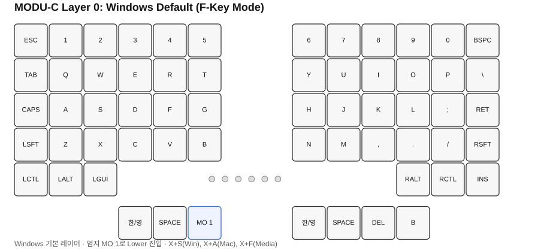
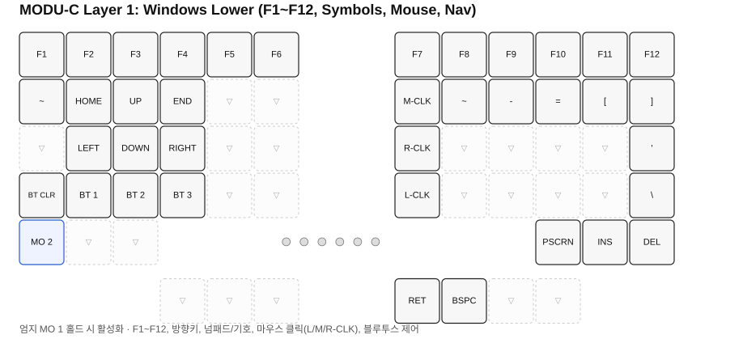
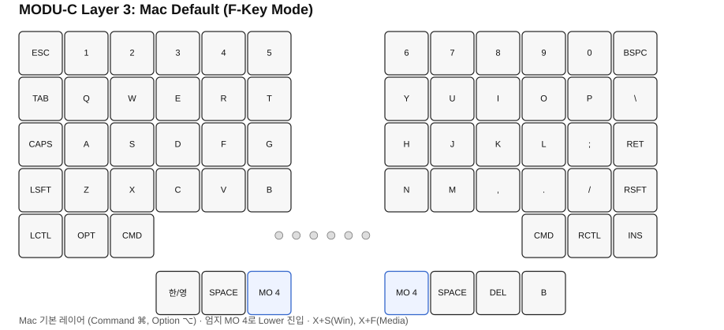
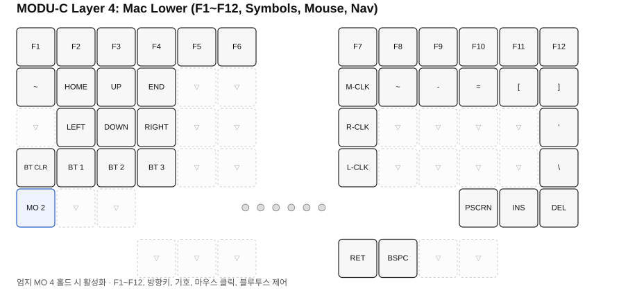
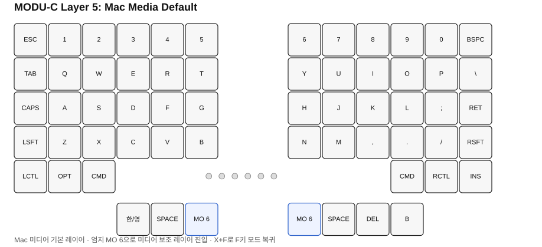
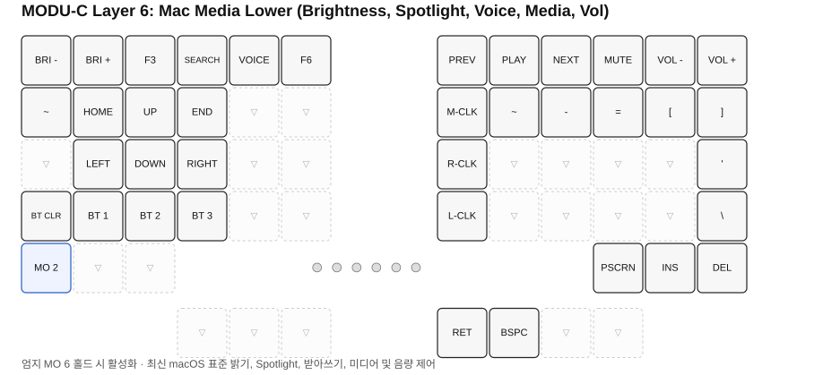
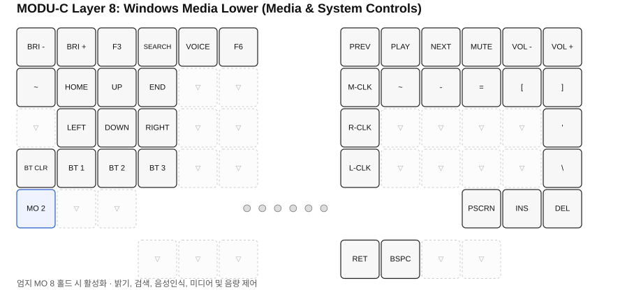
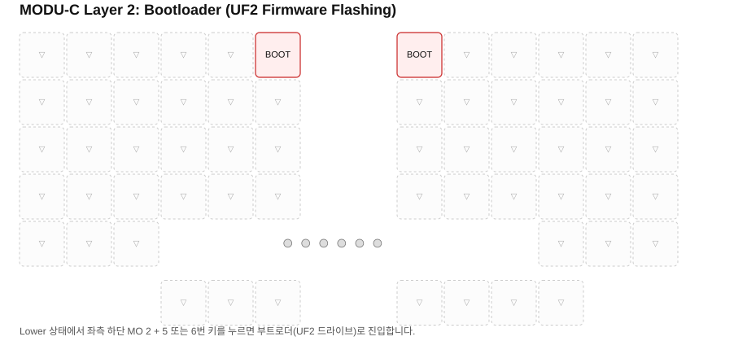

# MODU-C ZMK 커스텀 키맵 가이드 (Windows & Mac)

본 문서는 MODU-C 무선 스플릿 키보드에 적용된 **Windows/Mac 듀얼 모드**, **콤보 단축키**, **레이어 구성**, 그리고 **표준 기호 및 편집키 매핑**에 대한 안내서입니다.

---

## 1. 전체 레이어 구조

키보드는 총 **9개 레이어**로 구성되어 있으며, 각 레이어는 규격에 맞춰 정확히 67개 키 바인딩을 유지합니다.

| 레이어 번호 | 레이어 명 | 진입 방식 | 주요 기능 | 다이어그램 |
| :---: | :--- | :--- | :--- | :---: |
| **Layer 0** | **`default_layer`** | 기본값 / `to_win` 콤보 / `win_to_func` | **Windows 기본 레이어 (F키 모드)** (엄지에 `MO 1`) | [SVG](docs/layer-0-default.svg) |
| **Layer 1** | **`lower_layer`** | Windows F키 모드에서 엄지 `MO 1` 홀드 | **Windows 보조 레이어 (F1~F12, 기호/편집키)** | [SVG](docs/layer-1-lower.svg) |
| **Layer 2** | **`layer_2`** | Lower 상태에서 좌측 하단 `MO 2` 홀드 | **부트로더 레이어** (UF2 펌웨어 업데이트 플래싱 모드) | [SVG](docs/layer-2-bootloader.svg) |
| **Layer 3** | **`mac_layer`** | `to_mac` 콤보 / `mac_to_func` | **Mac 기본 레이어 (F키 모드)** (엄지에 `MO 4`) | [SVG](docs/layer-3-mac.svg) |
| **Layer 4** | **`mac_lower_layer`** | Mac F키 모드에서 엄지 `MO 4` 홀드 | **Mac 보조 레이어 (F1~F12, 기호/편집키)** | [SVG](docs/layer-4-mac-lower.svg) |
| **Layer 5** | **`mac_media_layer`** | `mac_to_media` 콤보 | **Mac 미디어 모드** (엄지에 `MO 6`) | [SVG](docs/layer-5-mac-media.svg) |
| **Layer 6** | **`mac_media_lower_layer`**| Mac 미디어 모드에서 엄지 `MO 6` 홀드 | **Mac 미디어 보조 레이어 (멀티미디어 키)** | [SVG](docs/layer-6-mac-media-lower.svg) |
| **Layer 7** | **`win_media_layer`** | `win_to_media` 콤보 | **Windows 미디어 모드** (엄지에 `MO 8`) | [SVG](docs/layer-7-win-media.svg) |
| **Layer 8** | **`win_media_lower_layer`**| Windows 미디어 모드에서 엄지 `MO 8` 홀드 | **Windows 미디어 보조 레이어 (멀티미디어 키)** | [SVG](docs/layer-8-win-media-lower.svg) |

### 레이어별 시각 프리뷰 (Visual SVG Layouts)

#### [Layer 0] Windows 기본 레이어 (`default_layer`)


#### [Layer 1] Windows 보조 레이어 (`lower_layer`)


#### [Layer 3] Mac 기본 레이어 (`mac_layer`)


#### [Layer 4] Mac 보조 레이어 (`mac_lower_layer`)


#### [Layer 5] Mac 미디어 기본 레이어 (`mac_media_layer`)


#### [Layer 6] Mac 미디어 보조 레이어 (`mac_media_lower_layer`)


#### [Layer 7] Windows 미디어 기본 레이어 (`win_media_layer`)


#### [Layer 8] Windows 미디어 보조 레이어 (`win_media_lower_layer`)


#### [Layer 2] 부트로더 레이어 (`layer_2`)


---

## 2. 콤보(Combos) 단축키 사용법

엄지 `MO` 키를 누르고 있는 동안(Lower 레이어 활성화 상태) 손가락으로 두 키를 함께 누르면 모드가 전환됩니다.

| 기능 | 조작 방법 | 동작 설명 |
| :--- | :--- | :--- |
| **Windows 모드 전환** | 엄지 `MO` 누른 채 **`X` + `S`** 입력 | Layer 0(`default_layer`) Windows 기본 모드로 전환 |
| **Mac 모드 전환** | 엄지 `MO` 누른 채 **`X` + `A`** 입력 | Layer 3(`mac_layer`) Mac 기본 모드로 전환 |
| **F키 ↔ 멀티미디어 키 토글** | 엄지 `MO` 누른 채 **`X` + `F`** 입력 | **현재 OS 안에서 F1~F12 ↔ 멀티미디어 키 모드 상호 전환** |
| **시스템 소프트 리셋** | 엄지 `MO` 누른 채 **`LCTRL(48)` + `5` + `6`** 입력 | 시스템 재부팅 (`&sys_reset`) |
| **부트로더(UF2 플래싱) 진입** | 엄지 `MO` 누른 채 좌측 하단 `MO 2` + 숫자 `5` 또는 `6` | USB 드라이브 모드로 부트로더 진입 |

> 💡 **`X + F` 토글 동작**:
> - **Windows 환경**: F1~F12 모드 ➔ Windows 미디어 모드 ➔ F1~F12 모드 상호 전환
> - **Mac 환경**: F1~F12 모드 ➔ Mac 미디어 모드 ➔ F1~F12 모드 상호 전환

---

## 3. Mac 최신 표준 멀티미디어 키 매핑 (`mac_media_lower_layer`)

`MO + X + F`를 눌러 미디어 모드로 전환한 후, 엄지 `MO`를 누르고 Row 0 상단 키를 누르면 최신 맥북 표준 기능이 작동합니다:

| 키 위치 | 아이콘 | 기능 이름 | ZMK 키 코드 | 설명 |
| :---: | :---: | :--- | :--- | :--- |
| **F1** | 🔅 | 화면 밝기 낮춤 | `&kp C_BRI_DN` | 디스플레이 밝기 감소 |
| **F2** | 🔆 | 화면 밝기 높임 | `&kp C_BRI_UP` | 디스플레이 밝기 증가 |
| **F3** | ⊞ | 미션 컨트롤 | `&kp F3` | 열려 있는 모든 창 보기 |
| **F4** | 🔍 | **Spotlight 검색 (돋보기)** | `&kp C_AC_SEARCH` | macOS 통합 검색창 팝업 |
| **F5** | 🎙️ | **받아쓰기 / 음성 입력 (마이크)**| `&kp C_VOICE_COMMAND` | 실시간 음성 인식 텍스트 입력 |
| **F6** | 🌙 | 집중 모드 (방해금지) | `&kp F6` | 알림 끄기 / 집중 모드 토글 |
| **F7** | ◀◀ | 이전 곡 재생 | `&kp C_PREV` | 이전 트랙으로 이동 |
| **F8** | ▶❚❚ | 재생 / 일시정지 | `&kp C_PP` | 음악·영상 재생 및 일시정지 |
| **F9** | ▶▶ | 다음 곡 재생 | `&kp C_NEXT` | 다음 트랙으로 이동 |
| **F10** | 🔇 | 음소거 | `&kp C_MUTE` | 소리 끄기 / 켜기 |
| **F11** | 🔉 | 볼륨 낮춤 | `&kp C_VOL_DN` | 소리 크기 줄이기 |
| **F12** | 🔊 | 볼륨 높임 | `&kp C_VOL_UP` | 소리 크기 키우기 |

---

## 4. Mac 모드 (`mac_layer`) 하단 및 엄지 배열

맥 OS 표준 환경에 맞춰 모디파이어 키 및 통일된 대칭 엄지 배치가 적용되어 있습니다.

```
[Row 4 좌측]  Control (^, &kp LCTRL)  |  Option (⌥, &kp LALT)  |  Command (⌘, &kp LGUI)
[Row 4 우측]  Command (⌘, &kp RGUI)   |  Control (^, &kp RCTRL)|  Insert (&kp INSERT)
[Row 5 엄지]  [Windows] 좌측: 한/영 (&kp LANG1) | Space (&kp SPACE) | Lower (&mo 1 / &mo 8)
                        우측: 한/영 (&kp LANG1) | Space (&kp SPACE) | Delete (&kp DELETE) | B
              [Mac]     좌측: 한/영 (&kp LANG1) | Space (&kp SPACE) | Lower (&mo 4 / &mo 6)
                        우측: Lower (&mo 4 / &mo 6) | Space (&kp SPACE) | Delete (&kp DELETE) | B
```

---

## 5. 표준 기호 및 편집키 매핑 (`lower_layer`, `mac_lower_layer`, `mac_media_lower_layer`)

기본 레이어에 빠져 있던 기호키들을 **표준 키보드의 손 위치**에 맞춰 배치했습니다. 엄지 `MO` 키를 누른 채 타이핑합니다:

| 구분 | 누르는 키 (`default_layer` 기준) | 입력되는 키 | 손가락 위치 및 특징 |
| :--- | :--- | :--- | :--- |
| **물결 / 백틱** | **`TAB`** 및 **`U`** 자리 | **`~` / `` ` ``** (`&kp GRAVE`) | 왼손 탭 또는 오른손 U 자리 (오른손 기호열: `~ - = [ ]`) |
| **마이너스** | **`I`** 자리 | **`-` / `_`** (`&kp MINUS`) | 오른손 상단 기호 연속열 (`- = [ ]`) |
| **이퀄 / 플러스** | **`O`** 자리 | **`=` / `+`** (`&kp EQUAL`) | 마이너스 바로 오른쪽 |
| **대괄호 열기** | **`P`** 자리 | **`[` / `{`** (`&kp LBKT`) | 표준 P 자리의 대괄호 열기 |
| **대괄호 닫기** | **`\` (`BSLH`)** 자리 | **`]` / `}`** (`&kp RBKT`) | 대괄호 열기 바로 오른쪽 (Row 1 끝) |
| **따옴표** | **`ENTER`** 자리 | **`'` / `"`** (`&kp SQT`) | **세미콜론(`;`) 바로 오른쪽!** 표준 따옴표 손 위치 일치 |
| **역슬래시** | **`RSHFT`** 자리 | **`\` / `\|`** (`&kp BSLH`) | 따옴표 바로 아래 (Row 3 끝) |
| **스크린샷** | **`RALT`** 자리 | **`PSCRN`** (Print Screen) | 윈도우 스크린샷 캡처 |
| **인서트** | **`RCTRL`** 자리 | **`INS`** (Insert) | 문서 삽입 모드 |
| **딜리트** | **`INSERT`** 자리 | **`DEL`** (Delete) | 우측 하단 끝 Del 키 (기본 레이어 엄지에도 Delete 지원) |

---

## 6. 포인팅 & 기능키 매핑 (`lower_layer`)

- **트랙볼 마우스 클릭**:
  - `Y` 자리: **휠/중간 클릭** (`&mkp MCLK`)
  - `H` 자리: **우클릭** (`&mkp RCLK`)
  - `N` 자리: **좌클릭** (`&mkp LCLK`)
- **방향키 및 네비게이션**:
  - `HOME`, `UP`, `END` / `LEFT`, `DOWN`, `RIGHT` (왼손 영역)
- **블루투스 페어링 제어**:
  - `BT_CLR` (페어링 초기화), `BT_SEL 0`, `BT_SEL 1`, `BT_SEL 2` (프로파일 1~3번 선택)
- **펑션키**:
  - Row 0 상단: `F1` ~ `F12`

---

> 💡 **안내**: GitHub Actions 자동 펌웨어 빌드는 `config/**` (키맵 및 레이아웃 설정) 또는 `build.yaml` 파일이 변경될 때만 실행됩니다. 문서나 이미지 변경 시에는 빌드가 실행되지 않습니다.
