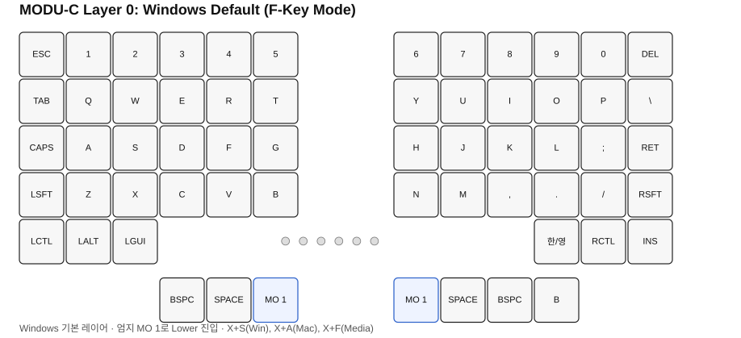
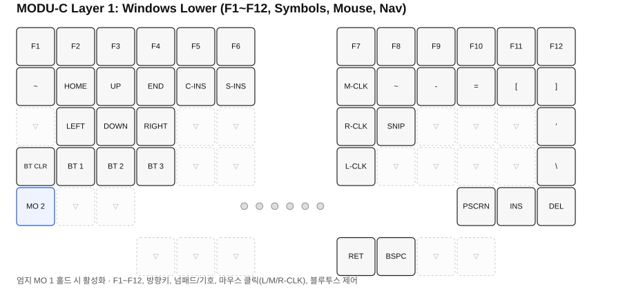
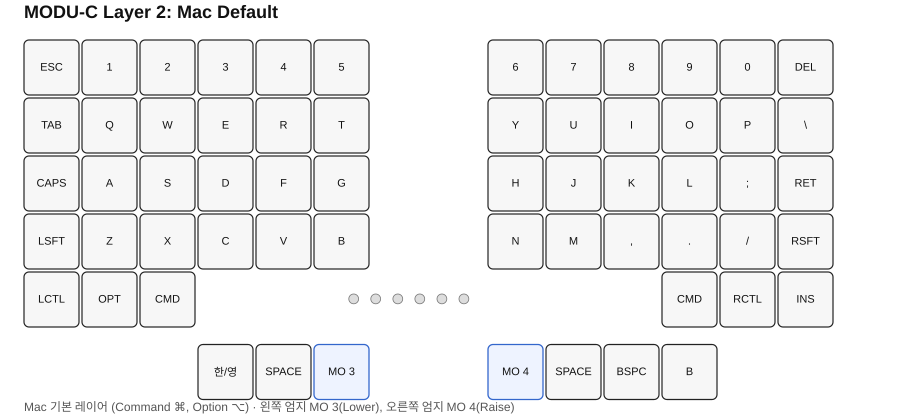
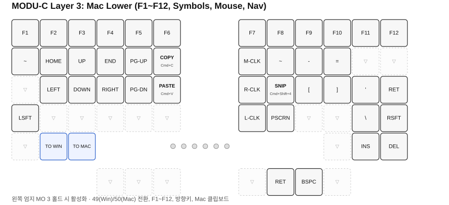
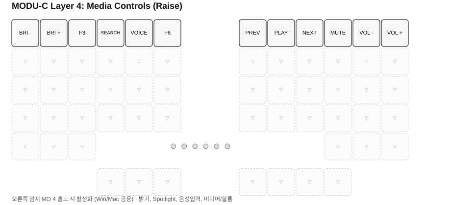
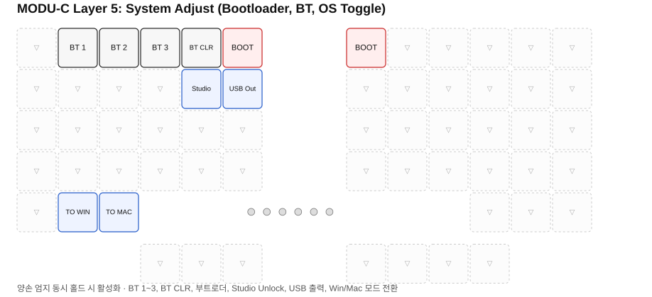

# MODU-C ZMK 커스텀 키맵 가이드 (Windows & Mac)

본 문서는 MODU-C 무선 스플릿 키보드에 적용된 **6개 레이어 최적화 아키텍처(Conditional Layers)**, **Windows/Mac 듀얼 모드**, **콤보 단축키**, 그리고 **표준 기호 및 편집키 매핑**에 대한 안내서입니다.

---

## 1. 전체 레이어 구조

기존 9개 레이어의 복잡한 모드 토글 방식을 ZMK의 **Conditional Layers(Lower + Raise = Adjust)** 패턴을 적용하여 **6개 레이어**로 대폭 최적화했습니다. 각 레이어는 67키 매트릭스 규격을 엄격하게 준수합니다.

| 레이어 번호 | 레이어 명 | 진입 방식 | 주요 기능 | 다이어그램 |
| :---: | :--- | :--- | :--- | :---: |
| **Layer 0** | **`default_layer`** | 기본값 / Adjust에서 `Alt(49)` | **Windows 기본 레이어** (왼쪽 엄지 `MO 1`, 오른쪽 엄지 `MO 4`) | [SVG](docs/layer-0-default.svg) |
| **Layer 1** | **`lower_layer`** | 왼쪽 엄지 `MO 1` 홀드 | **Windows 네비게이션 & F키 (F1~F12, 방향키, Win 클립보드, 기호, 마우스)** | [SVG](docs/layer-1-lower.svg) |
| **Layer 2** | **`mac_layer`** | Adjust에서 `Cmd(50)` | **Mac 기본 레이어** (왼쪽 엄지 `MO 3`, 오른쪽 엄지 `MO 4`) | [SVG](docs/layer-2-mac.svg) |
| **Layer 3** | **`mac_lower_layer`** | 왼쪽 엄지 `MO 3` 홀드 | **Mac 네비게이션 & F키 (F1~F12, 방향키, Mac 클립보드, 기호, 마우스)** | [SVG](docs/layer-3-mac-lower.svg) |
| **Layer 4** | **`raise_media`** | 오른쪽 엄지 `MO 4` 홀드 | **미디어 컨트롤 전용 (Win/Mac 공용: 밝기, 검색, 음성, 재생/정지, 볼륨)** | [SVG](docs/layer-4-raise-media.svg) |
| **Layer 5** | **`adjust_system`** | **양손 엄지 MO 동시 홀드** | **시스템 설정 (BT 1~3, BT 초기화, 부트로더, Studio, Win/Mac 모드 전환)** | [SVG](docs/layer-5-adjust-system.svg) |

---

### 레이어별 시각 프리뷰 (Visual SVG Layouts)

#### [Layer 0] Windows 기본 레이어 (`default_layer`)


#### [Layer 1] Windows 보조 레이어 (`lower_layer`)


#### [Layer 2] Mac 기본 레이어 (`mac_layer`)


#### [Layer 3] Mac 보조 레이어 (`mac_lower_layer`)


#### [Layer 4] 미디어 컨트롤 레이어 (`raise_media`)


#### [Layer 5] 시스템 설정 레이어 (`adjust_system`)


---

## 2. 모드 전환 및 시스템 조작 방법

**왼쪽 엄지 MO(Lower) 또는 양손 엄지 MO(Adjust)를 누른 상태에서** 직관적인 전용 키로 OS 모드를 즉시 전환합니다.

| 기능 | 조작 방법 | 동작 설명 |
| :--- | :--- | :--- |
| **Windows 모드 전환** | 엄지 `MO` 누른 채 **`49번 (Row 4 Col 1)`** 입력 | Layer 0(`default_layer`) Windows 기본 모드로 전환 (`&to 0`) |
| **Mac 모드 전환** | 엄지 `MO` 누른 채 **`50번 (Row 4 Col 2)`** 입력 | Layer 2(`mac_layer`) Mac 기본 모드로 전환 (`&to 2`) |
| **블루투스 기기 1~3번 선택** | 양손 엄지 누른 채 숫자 **`1`, `2`, `3`** 키 입력 | Bluetooth 프로파일 0~2번 선택 (`&bt BT_SEL 0~2`) |
| **블루투스 페어링 초기화** | 양손 엄지 누른 채 숫자 **`4`** 키 입력 | 현재 블루투스 연결 해제 및 초기화 (`&bt BT_CLR`) |
| **부트로더(UF2 플래싱) 진입** | 양손 엄지 누른 채 숫자 **`5` 또는 `6`** 키 입력 | 새 펌웨어 복사를 위한 USB 드라이브 모드 진입 (`&bootloader`) |
| **ZMK Studio 잠금 해제** | 양손 엄지 누른 채 **`R`** 키 입력 | 웹/앱 기반 실시간 키맵 에디터 잠금 해제 (`&studio_unlock`) |
| **USB 유선 출력 고정** | 양손 엄지 누른 채 **`T`** 키 입력 | 출력 경로를 USB 케이블로 지정 (`&out OUT_USB`) |
| **시스템 소프트 리셋** | Lower/Adjust 상태에서 **`LCTRL(48)` + `5` + `6`** 동시 입력 | 키보드 소프트웨어 재부팅 (`&sys_reset`) |

> 💡 **원키 OS 전환 (1-Thumb & 2-Thumb 지원)**:
> - 왼쪽 엄지(`Lower`)만 누른 상태에서도 `49번`으로 Windows, `50번`으로 Mac 전환이 가능합니다!
> - 양손 엄지(`Adjust`)를 누른 상태에서도 동일하게 작동합니다.

---

## 3. 멀티미디어 키 매핑 (`raise_media`)

오른손 엄지 첫 번째 키(`MO 4`)를 누른 상태에서 상단 Row 0을 누르면 OS 공통 미디어 제어 기능이 작동합니다:

| 키 위치 | 아이콘 | 기능 이름 | ZMK 키 코드 | 설명 |
| :---: | :---: | :--- | :--- | :--- |
| **F1** | 🔅 | 화면 밝기 낮춤 | `&kp C_BRI_DN` | 디스플레이 밝기 감소 |
| **F2** | 🔆 | 화면 밝기 높임 | `&kp C_BRI_UP` | 디스플레이 밝기 증가 |
| **F3** | ⊞ | 미션 컨트롤 (Mac) | `&kp F3` | macOS Mission Control |
| **F4** | 🔍 | **통합 검색 (돋보기)** | `&kp C_AC_SEARCH` | macOS Spotlight / Windows 검색 |
| **F5** | 🎙️ | **받아쓰기 / 음성 입력 (마이크)**| `&kp C_VOICE_COMMAND` | macOS 음성 명령 / Windows 음성 받아쓰기 |
| **F6** | 🌙 | 집중 모드 / 방해금지 | `&kp F6` | macOS 알림 끄기 토글 |
| **F7** | ◀◀ | 이전 곡 재생 | `&kp C_PREV` | 이전 트랙으로 이동 |
| **F8** | ▶❚❚ | 재생 / 일시정지 | `&kp C_PP` | 미디어 재생 및 일시정지 |
| **F9** | ▶▶ | 다음 곡 재생 | `&kp C_NEXT` | 다음 트랙으로 이동 |
| **F10** | 🔇 | 음소거 | `&kp C_MUTE` | 소리 끄기 / 켜기 |
| **F11** | 🔉 | 볼륨 낮춤 | `&kp C_VOL_DN` | 소리 크기 줄이기 |
| **F12** | 🔊 | 볼륨 높임 | `&kp C_VOL_UP` | 소리 크기 키우기 |

---

## 4. Windows vs Mac 모디파이어 및 엄지 배열 비교

Windows 표준 PC 환경과 macOS 표준 환경에 맞춰 좌측 모디파이어 및 엄지 배치가 각각 최적화되어 있습니다:

```
[Windows 모드 (Layer 0)]
Row 4 좌측:  Control (LCTRL)  |  Windows (LGUI)        |  Alt (LALT)              <- 표준 PC 순서!
Row 4 우측:  한/영 (LANG1)    |  Control (RCTRL)       |  Insert (INSERT)
Row 5 엄지:  [좌측] Backspace |  Space                 |  Lower (MO 1)
             [우측] Raise     |  Space                 |  Backspace | B

[Mac 모드 (Layer 2)]
Row 4 좌측:  Control (LCTRL)  |  Option (LALT)         |  Command (LGUI)          <- 표준 Mac 순서!
Row 4 우측:  Command (RGUI)   |  Control (RCTRL)       |  Insert (INSERT)
Row 5 엄지:  [좌측] 한/영     |  Space                 |  Lower (MO 3)
             [우측] Raise     |  Space                 |  Backspace | B
*(참고: Windows 및 Mac 모두 우측 상단 끝은 Delete, 우측 엄지 3번째 키는 Backspace로 통일)*
```

---

## 5. 표준 기호 및 편집키 매핑 (`lower_layer`, `mac_lower_layer`)

기본 레이어에 빠져 있던 기호키들을 **표준 키보드의 손 위치**에 맞춰 배치했습니다. 왼쪽 엄지 `MO` 키를 누른 채 타이핑합니다:

| 구분 | 누르는 키 (`default_layer` 기준) | 입력되는 키 | 손가락 위치 및 특징 |
| :--- | :--- | :--- | :--- |
| **물결 / 백틱** | **`TAB`** 및 **`U`** 자리 | **`~` / `` ` ``** (`&kp GRAVE`) | 왼손 탭 또는 오른손 U 자리 (오른손 기호열: `~ - = [ ]`) |
| **마이너스** | **`I`** 자리 | **`-` / `_`** (`&kp MINUS`) | 오른손 상단 기호 연속열 (`- = [ ]`) |
| **이퀄 / 플러스** | **`O`** 자리 | **`=` / `+`** (`&kp EQUAL`) | 마이너스 바로 오른쪽 |
| **대괄호 열기** | **`K`** 자리 (`-` 바로 밑) | **`[` / `{`** (`&kp LBKT`) | **마이너스(`-`) 바로 밑!** |
| **대괄호 닫기** | **`L`** 자리 (`=` 바로 밑) | **`]` / `}`** (`&kp RBKT`) | **이퀄(`=`) 바로 밑!** |
| **따옴표** | **`SEMI (;)`** 자리 | **`'` / `"`** (`&kp SQT`) | **세미콜론(`;`) 자리!** 우측 엔터 바로 옆 |
| **엔터** | **`ENTER`** 자리 | **`ENTER`** (`&kp ENTER`) | **기본 레이어와 동일한 엔터 위치 유지! (엄지에도 엔터 지원)** |
| **역슬래시** | **`FSLH (/)`** 자리 | **`\` / `\|`** (`&kp BSLH`) | **슬래시(`/`) 자리!** 우측 쉬프트 바로 옆 |
| **오른쪽 쉬프트** | **`RSHFT`** 자리 | **`RSFT`** (`&kp RIGHT_SHIFT`) | **우측 끝 쉬프트 완벽 지원!** |
| **왼쪽 쉬프트** | **`LSHFT`** 자리 | **`LSFT`** (`&kp LSHFT`) | **Lower 레이어에서도 Shift+방향키(선택), Shift+F키 완벽 지원!** |
| **전체 화면 캡처** | **`M`** 자리 (`SNIP` 바로 아래) | **`PSCRN`** (Print Screen) | 전체 화면 스크린샷 캡처 |
| **구역 캡처 (원키)** | **`J`** 자리 (`R-CLK` 바로 옆) | **`Win+Shift+S`** (Mac: `Cmd+Shift+4`) | **화면 구역(영역) 캡처 도구 단일키 실행** (`&kp LG(LS(S))` / `&kp LG(LS(N4))`) |
| **페이지 업** | **`R`** 자리 (`END` 바로 오른쪽) | **`PG_UP`** (Page Up) | 한 화면 위로 스크롤 |
| **페이지 다운** | **`F`** 자리 (`PG_UP` 바로 아래) | **`PG_DN`** (Page Down) | 한 화면 아래로 스크롤 |
| **복사 (Ctrl+Ins / Cmd+C)** | **`T`** 자리 (`PG_UP` 바로 오른쪽) | **`Ctrl + Insert`** (`&kp LC(INS)`) / Mac: **`Cmd + C`** (`&kp LG(C)`) | 표준 복사 단축키 (터미널/에디터 원키 복사) |
| **붙여넣기 (Shift+Ins / Cmd+V)**| **`G`** 자리 (`복사` 바로 아래) | **`Shift + Insert`** (`&kp LS(INS)`) / Mac: **`Cmd + V`** (`&kp LG(V)`) | 표준 붙여넣기 단축키 (터미널/에디터 원키 붙여넣기) |
| **인서트** | **`RCTRL`** 자리 | **`INS`** (Insert) | 문서 삽입 모드 |
| **딜리트** | **`INSERT`** 자리 | **`DEL`** (Delete) | 우측 하단 끝 Del 키 |

---

## 6. 포인팅 & 기능키 매핑 (`lower_layer`)

- **트랙볼 마우스 클릭 & 캡처**:
  - `Y` 자리: **휠/중간 클릭** (`&mkp MCLK`)
  - `H` 자리: **우클릭** (`&mkp RCLK`)
  - `J` 자리: **구역 캡처 (원키)** (`Win+Shift+S` / Mac: `Cmd+Shift+4`) — **R-CLK 바로 옆 배치!**
  - `M` 자리: **전체 화면 캡처** (`PSCRN`) — **구역 캡처(J) 바로 아래 배치!**
  - `N` 자리: **좌클릭** (`&mkp LCLK`)
- **방향키, 네비게이션 & 빠른 클립보드 (왼손 완성형 클러스터)**:
  - Row 1: `HOME (Q)` | `UP (W)` | `END (E)` | **`PG_UP (R)`** | **`복사: Ctrl+Ins / Cmd+C (T)`**
  - Row 2: `LEFT (A)` | `DOWN (S)` | `RIGHT (D)` | **`PG_DN (F)`** | **`붙여넣기: Shift+Ins / Cmd+V (G)`**
  - 상하 수직 페어링: Page Up / Page Down (R / F 열), 복사 / 붙여넣기 (T / G 열) 배치!
- **양손 쉬프트 & 엔터 지원**:
  - 좌측: `LSHFT` (Left Shift 자리 유지)
  - 우측: `ENTER` (원래 엔터 자리), `RSHFT` (원래 우측 쉬프트 자리)
- **펑션키**:
  - Row 0 상단: `F1` ~ `F12`

---

> 💡 **안내**: GitHub Actions 자동 펌웨어 빌드는 `config/**` (키맵 및 레이아웃 설정) 또는 `build.yaml` 파일이 변경될 때만 실행됩니다. 문서나 이미지 변경 시에는 빌드가 실행되지 않습니다.
